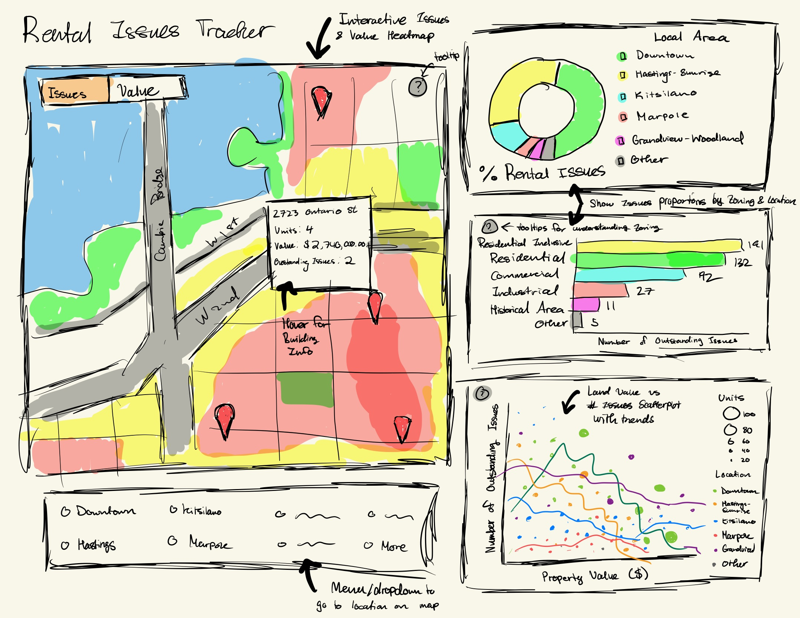

## Motivation and Purpose

Our role: Data analyst consultancy firm

Target audiences: Tenants, Prospective Renters and Investors.

Ensuring safe and well-maintained rental properties is essential for both tenants and property owners. Unaddressed by-law violations may indicate issues such as maintenance neglect, structural problems, or regulatory non-compliance, potentially impacting housing quality. To address these concerns, we are developing an interactive data visualization dashboard that combines rental property by-law issues with property tax data that will help users identify trends, pinpoint high-risk properties, explore the connection between property violations and tax assessments, and estimate rental costs. Through features like interactive filtering and geospatial mapping, our dashboard aims to empower tenants, property owners and investors to make data-driven decisions that enhance rental housing conditions.

## Description of the Data

We will be using two datasets from the Vancouver Open Data portal to explore the relationship between **rental issues and property values** across different neighborhoods.

### **1. Property Tax Report (2025)**

This dataset contains property assessment values, tax information, and zoning details for properties in Vancouver.

- **Key attributes:**
  - `PID`, `FROM_CIVIC_NUMBER`, `TO_CIVIC_NUMBER`, `STREET_NAME`: Unique property identifiers and address details.
  - `CURRENT_LAND_VALUE`, `CURRENT_IMPROVEMENT_VALUE`: Assessed property value.
  - `TAX_LEVY`: Total property tax levied.
  - `YEAR_BUILT`, `BIG_IMPROVEMENT_YEAR`: Construction and renovation details.
  - `ZONING_CLASSIFICATION`: Classification of property zones.

### **2. Rental Standards - Current Issues**

This dataset records **unresolved rental issues** in multi-unit buildings (5+ units). The dataset is updated daily, so for now we
will be using the database as obtained on **January 10th, 2025**.

- **Key attributes:**
  - `business_operator`: The landlord and/or property management company associated to the property.
  - `DetailURL`: Address of the webpage which contains additional information on the current by-law issue(s).
  - `streetnumber`, `street`: Property address for merging datasets.
  - `TOTALOUTSTANDING`: Count of unresolved rental issues.
  - `TotalUnits`: Number of rental units per property.
  - `Geo Local Area`, `geo_point_2d`: Neighborhood and geolocation data.

The Property Tax Report dataset has 224,726 rows and 7 columns, while the Rental Standards dataset has 466 rows and 9 columns.
This analysis will help identify trends and challenges in Vancouver’s rental market.

## Research questions and usage scenarios

### Research questions

- Which neighborhoods have the highest number of property by-law violations?
- Which districts have the lowest property values?
- Which zoning classifications have the highest number of by-law violations?
- Are there any property management companies that are frequently associated to rental issues?
- Is there a correlation between property values and the number of outstanding violations?

### Usage Scenarios

Mark is an international student arriving in Vancouver for the first time to attend a program at UBC. Since he was unable to secure a room in the UBC dorms, he must look for off-campus rental housing. Being unfamiliar with the city, he finds it challenging to identify affordable housing options and determine which neighborhoods are safe and quiet to live in.

After some time, Mark is introduced to the Rental Issue Tracker app, which features an interactive dashboard with a map of Vancouver. This tool allows him to explore different neighborhoods and districts, providing insights into property values and unresolved by-law violations. In addition to the interactive map, the app offers various statistical charts that present property-related information in a clear and informative manner.

By using this app, Mark can make more informed decisions, helping him find suitable housing that enhances his overall living experience in Canada.

## App sketch & brief description

The app features an interactive map highlighting different neighborhoods in Vancouver. Users can hover over specific areas to view brief information about rental properties. In the Issues tab, areas shaded in red indicate districts with a high number of unresolved by-law violations. In contrast, in the Value tab, red signifies districts with high property values.

To explore different areas, users can utilize a dropdown menu or similar navigation tools located in the bottom corner. Beyond the interactive map, the app provides additional insights through various charts on the right. These charts offer a detailed analysis of rental issues based on property type and local area, as well as the correlation between property values and the number of outstanding violations.
